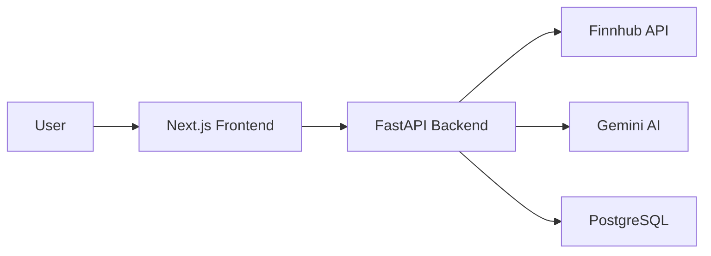

 # Finthropic

AI-powered financial research platform that transforms market news into structured, actionable research reports using Large Language Models.

---

## Overview

Finthropic streamlines financial research by combining real-time market data, AI-driven event extraction, historical context, and automated report generation. Instead of manually reviewing numerous news articles, users can generate structured research reports for a company or asset in a few steps.

The project consists of a **FastAPI backend** responsible for data processing and AI workflows, and a **Next.js frontend** that provides an intuitive interface for generating, browsing, and viewing reports.

---

## Features

- AI-powered financial report generation
- Market news retrieval and processing
- Event extraction from financial news
- Historical context integration
- Search and browse generated reports
- Interactive dashboard
- Responsive Next.js interface
- RESTful FastAPI backend
- PostgreSQL + SQLAlchemy persistence
- Modular service-oriented backend architecture

---

## Architecture



---

## Project Structure

```text
finthropic/
│
├── backend/
│   ├── app/
│   │   ├── routers/
│   │   ├── services/
│   │   ├── models/
│   │   ├── schemas/
│   │   ├── database/
│   │   ├── prompts/
│   │   ├── config/
│   │   └── utils/
│   └── tests/
│
├── frontend/
│   ├── app/
│   ├── components/
│   ├── hooks/
│   ├── services/
│   ├── providers/
│   ├── lib/
│   ├── types/
│   └── public/
│
└── README.md
```

---

## Tech Stack

| Category | Technology |
|----------|------------|
| Frontend | Next.js |
| Backend | FastAPI |
| Language | Python, TypeScript |
| Database | PostgreSQL |
| ORM | SQLAlchemy |
| AI | Google Gemini |
| Market Data | Finnhub API |
| Styling | Tailwind CSS |
| State Management | React Query |

---

## Getting Started

### Clone the repository

```bash
git clone <repository-url>
cd finthropic
```

### Backend

```bash
cd backend

python -m venv venv

source venv/bin/activate
# Windows
venv\Scripts\activate

pip install -r requirements.txt

uvicorn app.main:app --reload
```

### Frontend

```bash
cd frontend

npm install

npm run dev
```

---

## Configuration

Create a `.env` file for the backend.

Typical configuration includes:

```env
DATABASE_URL=<your_database_url>

FINNHUB_API_KEY=<your_finnhub_key>

GEMINI_API_KEY=<your_gemini_key>
```

---

## Workflow

```text
User Request
      │
      ▼
Frontend
      │
      ▼
FastAPI Backend
      │
      ├── Fetch market news
      ├── Score relevant news
      ├── Extract financial events
      ├── Retrieve historical context
      ├── Generate AI report
      └── Store report
      │
      ▼
Frontend Report Viewer
```

---

## API

The backend exposes REST APIs for:

- Health checks
- Report generation
- Report retrieval
- Company data
- Financial event processing

Interactive API documentation is available after running the backend:

```
http://localhost:8000/docs
```

---

## Development

### Backend

```bash
uvicorn app.main:app --reload
```

### Frontend

```bash
npm run dev
```

### Tests

```bash
pytest
```

---

## Roadmap

- Authentication and user management
- Report export (PDF)
- Portfolio watchlists
- Advanced analytics
- Improved historical reasoning
- Background job processing
- Docker deployment

---

## Contributing

Contributions are welcome.

1. Fork the repository.
2. Create a feature branch.
3. Commit your changes.
4. Open a Pull Request.

Please ensure code is tested and follows the existing project structure.

---

## License

This repository is intended for educational and internship purposes. Licensing information has not been specified.

---

## Author

**Mridul Goyal**

AI Engineer • Generative AI • Machine Learning

---

## Acknowledgements

- FastAPI
- Next.js
- SQLAlchemy
- Google Gemini
- Finnhub
- React Query 
